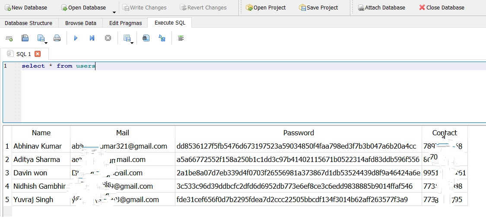

# CodeFlow-Coding-Buddy

CodeFlow-Coding-Buddy is a comprehensive Android application designed to help developers find suitable coding partners and collaborate on coding projects. The app uses skill-based matching to connect developers with compatible coding partners who have complementary skills, and features a range of useful tools and resources to facilitate collaboration and communication.

## Developers

This project was developed by two motivated students:
- Aditya Sharma (**20BCS3512**)
- Yuvraj Singh (**20BCS3527**)

## Screenshots

Check out these screenshots to see CodeFlow-Coding-Buddy in action!

1. **First Page** - This is the welcome screen that users see when they launch the app. The app's simple and intuitive interface makes it easy for users to get started.

  

2. **Login / Register Page** - Users can quickly and easily create a new account or log in to their existing account from this screen.

  

3. **Register Page** - The app's user registration process is straightforward and easy to follow, allowing users to create a profile and start looking for coding partners in no time.

  

4. **Login Page Showing Error Message** - If a user enters an incorrect username or password, the app provides an error message to help them quickly identify and correct the issue.

  

5. **User Page** - Once users have created a profile and logged in, they can access their personal user page. This page displays their skills and other important information, making it easy for potential coding partners to find them.

  

6. **Result Page** - When users search for coding partners using the app's skill-based matching system, they're presented with a list of potential matches. This page provides an overview of each match's skills and allows users to view their profiles in more detail.

  

7. **User Details Page** - When users view a potential coding partner's profile, they can see detailed information about their skills, experience, and preferences. This helps users make informed decisions about who to collaborate with.

  

## Requirements

To run CodeFlow-Coding-Buddy on your Android device, you'll need the following:
- An Android device running Android version 10 or higher
- SQLite
- Android Studio version 2022.2.1 or higher

## How to Run the App

To run CodeFlow-Coding-Buddy on your Android device, simply follow these steps:
1. Clone the repository
2. Open Android Studio
3. Unzip the project (if necessary)
4. Import the project into Android Studio
5. Connect your Android device to your computer using a USB cable, and enable USB debugging
6. Click on the start icon to launch the app

## Features

CodeFlow-Coding-Buddy is packed with useful features to help developers connect with coding partners, collaborate on coding projects, and access useful resources and tools. Here are just a few of the app's key features:
- Skill-based matching to connect developers with compatible coding partners
- User registration and login functionality
- User profile pages with customizable details and preferences
- Secure Authentication System (**Password Hash**)

  

## Conclusion

Thank you for your interest in CodeFlow-Coding-Buddy! We believe that this app has the potential to revolutionize the way that developers find and collaborate with coding partners, and we're excited to share it with the world. If you have any questions or feedback, please don't hesitate to get in touch. We'd love to hear from you!

##LICENSE
MIT License

Copyright (c) 2023 Aditya_Sharma

Permission is hereby granted, free of charge, to any person obtaining a copy
of this software and associated documentation files (the "Software"), to deal
in the Software without restriction, including without limitation the rights
to use, copy, modify, merge, publish, distribute, sublicense, and/or sell
copies of the Software, and to permit persons to whom the Software is
furnished to do so, subject to the following conditions:

The above copyright notice and this permission notice shall be included in all
copies or substantial portions of the Software.

THE SOFTWARE IS PROVIDED "AS IS", WITHOUT WARRANTY OF ANY KIND, EXPRESS OR
IMPLIED, INCLUDING BUT NOT LIMITED TO THE WARRANTIES OF MERCHANTABILITY,
FITNESS FOR A PARTICULAR PURPOSE AND NONINFRINGEMENT. IN NO EVENT SHALL THE
AUTHORS OR COPYRIGHT HOLDERS BE LIABLE FOR ANY CLAIM, DAMAGES OR OTHER
LIABILITY, WHETHER IN AN ACTION OF CONTRACT, TORT OR OTHERWISE, ARISING FROM,
OUT OF OR IN CONNECTION WITH THE SOFTWARE OR THE USE OR OTHER DEALINGS IN THE
SOFTWARE.
